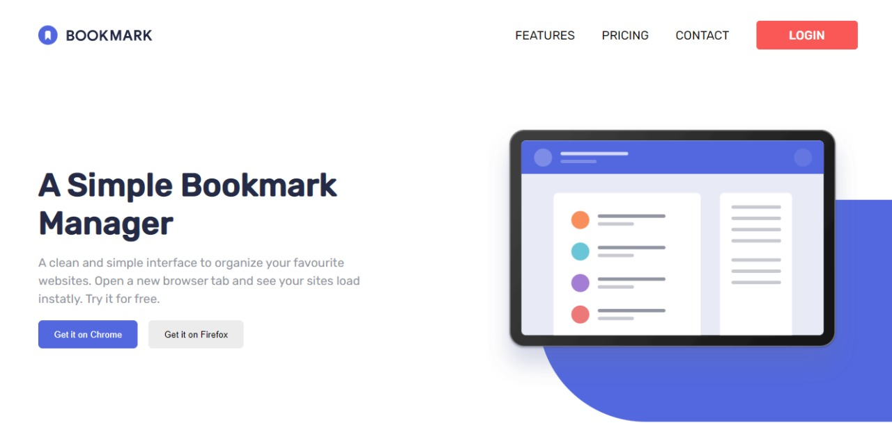
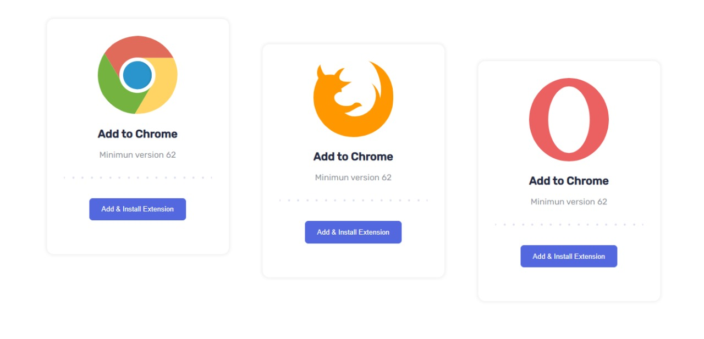
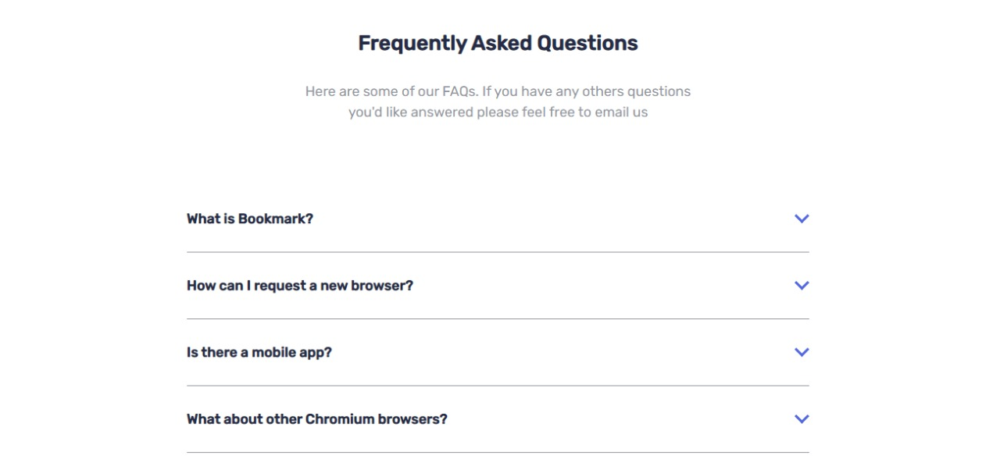

# Frontend Mentor - Bookmark landing page solution

This is a solution to the [Bookmark landing page challenge on Frontend Mentor](https://www.frontendmentor.io/challenges/bookmark-landing-page-5d0b588a9edda32581d29158). Frontend Mentor challenges help you improve your coding skills by building realistic projects. 

## Table of contents

- [Overview](#overview)
  - [The challenge](#the-challenge)
  - [Screenshot](#screenshot)
  - [Links](#links)
- [My process](#my-process)
  - [Built with](#built-with)
  - [What I learned](#what-i-learned)
  - [Continued development](#continued-development)
- [Author](#author)


**Note: Delete this note and update the table of contents based on what sections you keep.**

## Overview

### The challenge

Users should be able to:

- View the optimal layout for the site depending on their device's screen size
- See hover states for all interactive elements on the page
- Receive an error message when the newsletter form is submitted if:
  - The input field is empty
  - The email address is not formatted correctly

### Screenshot






### Links

- Solution URL: [Add solution URL here](https://your-solution-url.com)
- Live Site URL: [Add live site URL here](https://your-live-site-url.com)

## My process

### Built with

- HTML5
- SASS
- [React](https://reactjs.org/) - JS library


### What I learned

To see how you can add code snippets, see below:

```js
    const [toggle,setToggle] = useState({
        active:false
    });
    const handleClick = () => {
        setToggle( prevState => ({active:!prevState.active}))
        console.log(toggle.active)
    }
```

### Continued development

I've been developing in ReactJS for a while and I'm always learning, I also handle tools like Redux, TypeScript, NodeJS, ExpressJS, Sequelize, PostgreSQL, Moongose and MongoDB.


## Author

- Website - [Luis Martinez porftfolio](https://mrluismartinez.site/)
- Frontend Mentor - [@MrLuis-WebMaster](https://www.frontendmentor.io/profile/MrLuis-WebMaster)
- Linkedin - [@Luis Martinez](https://www.linkedin.com/in/luismartinez-javascript/)
